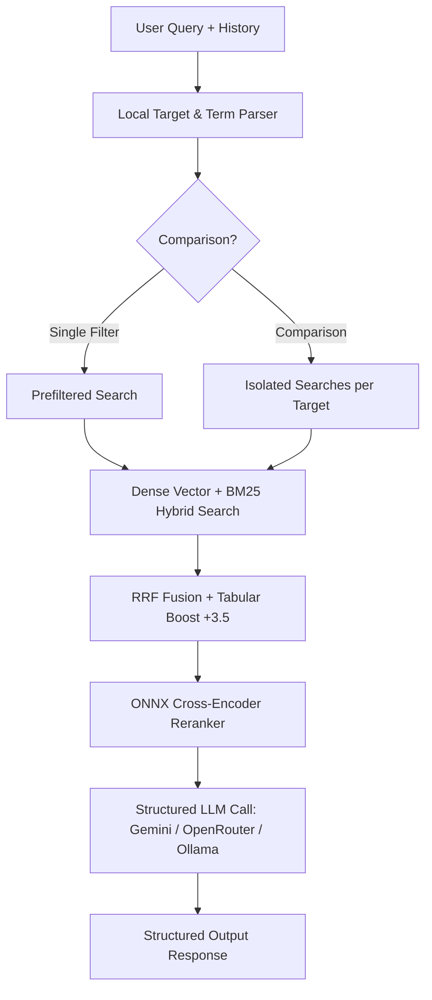

# DriveWise RAG - Premium Car Brochure Explorer

[](https://cei-dtlo.onrender.com)

**Live Demo URL**: [https://cei-dtlo.onrender.com](https://cei-dtlo.onrender.com)

DriveWise RAG is an advanced Retrieval-Augmented Generation (RAG) web application designed to query and compare technical specifications directly from official car brochures with 100% factual grounding, precise page citations, and variant disambiguation.

---

## 1. System Architecture



---

## 2. Features

* **Zero-Leak Hybrid Search**: Combines semantic dense retrieval (local embeddings) and sparse BM25 keyword matching with local ONNX Cross-Encoder reranking.
* **Isolated Multi-Target Retrieval**: Prevents cross-brand feature bleeding during comparisons by isolating database scopes.
* **Multi-Provider Pipeline**: Supports **Gemini** (default), **OpenRouter** (`openrouter/free` auto-routing), and **Ollama** (100% offline & local).
* **Automatic Local Fallback**: Automatically redirects queries to local Ollama if remote APIs encounter rate limits (429) or connection issues.
* **Variant Disambiguation**: Extracts distinct variant specs (e.g. CNG vs Petrol boot space) instead of returning a single high-scored value.

---

## 3. Quick Local Setup

1. **Clone and Navigate**:
   ```bash
   git clone <repo-url>
   cd DriveWise-RAG
   ```

2. **Configure Environment (`.env`)**:
   Create a `.env` file from the `.env.example` template:
   ```ini
   LLM_PROVIDER=gemini
   GEMINI_API_KEY=your_key_here
   MOCK_LLM=true # Set to false to use live remote models
   ```

3. **Install and Run**:
   ```bash
   pip install -r requirements.txt
   python src/ingestion/extract_covers.py
   python src/app.py
   ```
   Open `http://localhost:8000/` in your browser.
